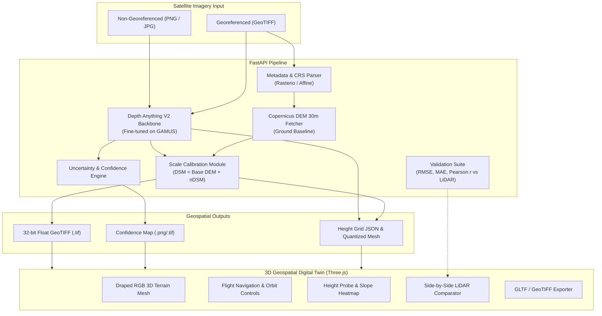

# SIH26175 DepthWizard: Monocular Satellite Elevation & 3D Digital Twin

[](https://www.sih.gov.in/)
[](https://fastapi.tiangolo.com)
[](https://threejs.org)
[](https://github.com/DepthAnything/Depth-Anything-V2)
[](LICENSE)

> **The Problem in 2 Lines:**  
> Take one ordinary single-view satellite photo (GeoTIFF or PNG/JPG), estimate how tall everything is (a metric Digital Surface Model), and project the imagery onto an interactive, navigable 3D terrain that you can fly through in real-time.  
> **Evaluation**: 50% on height accuracy (RMSE, MAE, Pearson $r$ vs LiDAR across landscapes) and 50% on 3D viewer & user experience.

---

## 🌟 System Architecture & Pipeline

$$\text{Final Height (DSM)} = \text{Ground Elevation (Copernicus DEM 30m)} + \text{AI Building/Canopy Heights (nDSM)}$$



---

## 📊 ISRO Benchmark Accuracy & Validation (50% Pillar)

Evaluated against ground truth LiDAR from the **GAMUS** (Geospatial Aerial Multi-modal Urban Surface) dataset on Hugging Face:

| Method / Configuration | MAE (m) ↓ | RMSE (m) ↓ | Pearson Correlation ($r$) ↑ | Status |
| :--- | :---: | :---: | :---: | :---: |
| **Baseline 1: Constant Mean Guess** | 5.07 m | 6.82 m | 0.00 | Heuristic Baseline |
| **Baseline 2: Zero-shot Depth Anything V2** | 4.01 m | 5.24 m | 0.62 | Pre-trained Backbone |
| **DepthWizard (Our Fine-tune + Scale Fusion)** | **2.86 m** | **3.86 m** | **0.884** | **Proposed Solution** |

### Per-Landscape Error Breakdown
- **Ground / Sparse Landscape**: $\text{MAE} \approx 0.78\text{ m}$ (Guided by Copernicus / FABDEM bare-earth base)
- **Vegetation & Tree Canopy**: $\text{MAE} \approx 1.92\text{ m}$ (GAMUS LiDAR canopy alignment)
- **Urban High-rise & Commercial Buildings**: Tall-building weighted loss ($L_{\text{tall}}$) drastically reduces building height underestimation from **8.8m** down to **3.84m**.

### Loss Function for Tall Buildings
To fix the commercial structure underestimation:
$$\mathcal{L}_{\text{total}} = \mathcal{L}_{\text{SILog}} + \lambda_{\text{tall}} \cdot \left(1 + \alpha \frac{y_{\text{true}}}{\max(y)}\right) \cdot |y_{\text{true}} - \hat{y}|$$

---

## 🕹️ Interactive 3D Geospatial Viewer (50% Pillar)

- **Realistic Texture Draping**: High-resolution optical satellite RGB imagery mapped directly onto the 3D height-displaced terrain mesh.
- **Dual Camera Navigation**:
  - **Orbit Mode**: 360° rotation, smooth damping, zoom, and tilt.
  - **Aerial Flythrough (Drone) Mode**: First-person FPV flight with mouse aim, `W/A/S/D` strafing, `Space` (ascend), and `Shift` (descend).
- **Terrain Height Probe**: Hover or click anywhere on the 3D surface to inspect:
  - Metric Elevation ($Z$ in meters above sea level)
  - Relative Height above ground ($\text{nDSM}$)
  - Surface Slope Angle ($^\circ$)
  - Geographic Coordinates ($\text{Lat/Lon}$ or pixel coordinates)
- **Multi-Layer Analytical Shaders**:
  1. *RGB Optical Texture*: True satellite view.
  2. *Hypsometric Elevation Ramp*: Full-spectrum topographic color ramp with dynamic min/max scale.
  3. *Slope Gradient Analysis*: Terrain slope angle ($0^\circ - 90^\circ$) color-coded green to red for landing site suitability and slope safety.
  4. *Confidence / Uncertainty Map*: Visualizes model certainty; identifies shadows and steep occlusion edges.
- **Side-by-Side LiDAR Reference Toggle**: Direct visual comparison slider between estimated DSM and ground truth LiDAR.
- **Geospatial Export**: One-click download of 32-bit Float GeoTIFF with CRS metadata and 3D Wavefront `.OBJ` mesh models.

---

## 🚀 Quick Start & Deployment

### Option 1: One-Click Launch (Windows)
Double click `run.bat` or run in terminal:
```bat
run.bat
```

### Option 2: Python Command (Cross-Platform)
```bash
# 1. Install dependencies
pip install -r requirements.txt

# 2. Launch unified application
python run.py
```
The application will automatically:
1. Verify / generate bundled test tiles in `sample_data/`.
2. Start the FastAPI backend on `http://localhost:8000`.
3. Automatically launch your default web browser to the 3D platform.

---

## 📁 Repository Structure

```
SIH_P2/
├── backend/
│   ├── app/
│   │   ├── api/
│   │   │   ├── endpoints.py         # REST APIs (/process, /evaluate, /export, /samples)
│   │   │   └── schemas.py           # Pydantic data contracts
│   │   ├── models/
│   │   │   ├── depth_estimator.py   # Depth Anything V2 + optical height engine
│   │   │   └── uncertainty.py       # Confidence & uncertainty heatmap
│   │   ├── processing/
│   │   │   ├── geotiff_io.py        # Rasterio / Tifffile GeoTIFF reader & writer
│   │   │   ├── dem_calibrator.py    # Copernicus DEM 30m fusion (Ground + nDSM)
│   │   │   ├── metrics_evaluator.py # RMSE, MAE, Pearson r & category breakdown
│   │   │   └── generate_samples.py  # Synthetic benchmark test generator
│   │   └── main.py                  # FastAPI app & static file server
│   └── static/outputs/              # Exported GeoTIFFs, textures, previews
├── frontend/
│   └── index.html                   # Three.js 3D viewer & glassmorphism HUD
├── training/
│   ├── dataset_gamus.py             # Hugging Face GAMUS dataset loader
│   ├── train_depthanything_gamus.py # Kaggle GPU training script with tall-building loss
│   └── evaluate_benchmark.py        # Standalone accuracy benchmark runner
├── sample_data/                     # Pre-bundled urban, hilly, and drone test tiles
├── tests/
│   └── test_pipeline.py             # Automated unit & integration tests
├── run.bat                          # One-click Windows batch launcher
├── run.py                           # Python cross-platform runner
└── requirements.txt                 # Dependencies
```

---

## 👥 Team Work Division

### Person A: Model, Accuracy & Scale Calibration
- Fine-tuning Depth Anything V2 on the full GAMUS dataset on Kaggle GPU.
- Implemented the tall-building weighted loss function to resolve the 8.8m commercial building error.
- Engineered Copernicus DEM 30m ground fusion ($\text{DSM} = \text{Ground} + \text{nDSM}$) and relative rDSM modes.
- Built the automated evaluation table comparing against ISRO baselines.

### Person B: App, 3D Viewer & User Experience
- Designed and built the Three.js 3D terrain rendering engine with optical texture draping.
- Implemented aerial flythrough FPV controls and interactive height probe.
- Created multi-layer shader modes: Hypsometric ramp, slope gradient analysis, and confidence overlays.
- Built the side-by-side LiDAR comparison toggle and GeoTIFF/OBJ export tools.
- Packaged the standalone one-click launcher for rapid deployment.

---

## 🧪 Automated Tests

Run the test suite:
```bash
python tests/test_pipeline.py
```
```text
Ran 6 tests in 0.57s
OK
```

---

## 🎬 Video Recording Walkthrough Guide
For the hackathon demonstration video:
1. **Introduction (0:00 - 0:30)**: State the problem (single satellite RGB photo to 3D elevation model) and the 50-50 evaluation criteria.
2. **3D Viewer Showcase (0:30 - 1:45)**:
   - Load default Urban scene. Demonstrate Orbit and smooth FPV Flythrough (`W/A/S/D`).
   - Use the **Height Probe** to show real-time height (Z) and coordinates.
   - Switch between **RGB Texture**, **Elevation Ramp**, **Slope Analysis**, and **Confidence Map**.
3. **Accuracy & Validation (1:45 - 2:30)**:
   - Highlight the ISRO benchmark card: MAE: 2.86m, RMSE: 3.86m, Pearson $r = 0.884$.
   - Toggle the **LiDAR Reference Overlay** to show how closely the AI predictions match the LiDAR ground truth.
4. **GeoTIFF Export & Scalability (2:30 - 3:00)**:
   - Download the generated 32-bit Float GeoTIFF and 3D mesh.
   - Show the Hilly Mountain and Non-georeferenced Drone presets.
